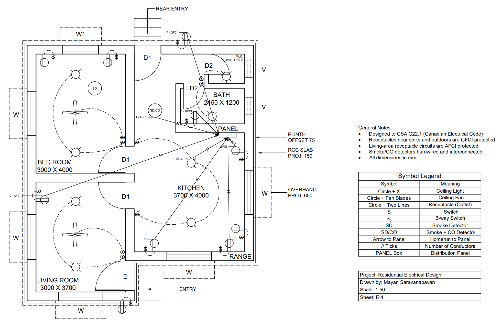
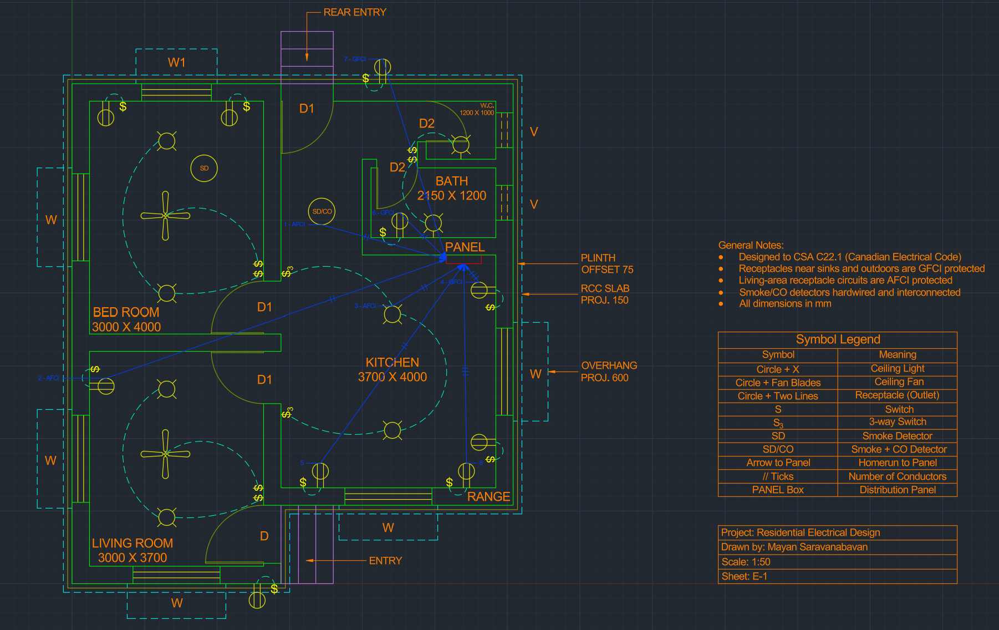
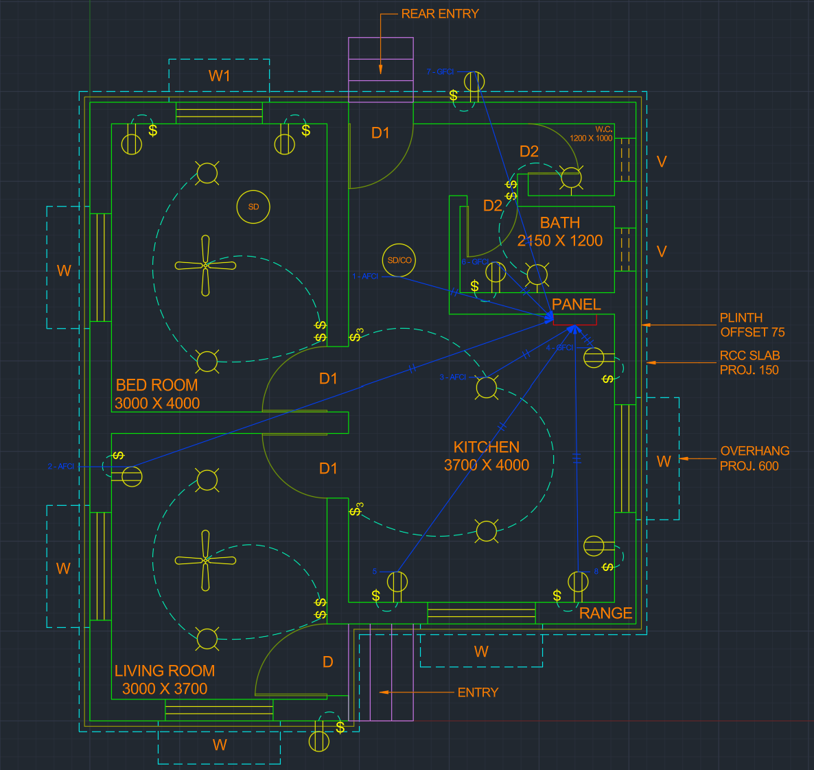

# Residential Electrical Design

An electrical plan for a single-dwelling house, drawn in AutoCAD and designed to the
Canadian Electrical Code (CSA C22.1). The project covers the full workflow of a real
electrical design package: a lighting and power layout, branch-circuit design with
homeruns back to the panel, a panel schedule with conductor and breaker sizing, a
CEC load calculation to size the service, and a voltage-drop check.

## The drawing

**Final plotted sheet (E-1): plan, symbol legend, general notes, and title block**
([PDF](Residential_Electrical_Design_E-1.pdf)):

**Full drawing in AutoCAD (with legend, notes, and title block):**

**Circuited plan, with eight homeruns fanning back to the distribution panel:**

## Documentation

Three supporting documents back the drawing. Together with the plan, they form the
complete design package:

- **[Load Calculation](CEC_Load_Calculation.md):** sizes the electrical service using
  the CEC single-dwelling method (Rule 8-200). Works out the calculated load for both a
  gas-heat and an electric-heat case and confirms a 100 A service.

- **[Branch Circuits & Panel Schedule](CEC_Panel_Schedule.md):** the panel's directory,
  listing every circuit with its breaker, conductor, protection (GFCI/AFCI), leg, and
  load. Also explains what is required by code versus a design choice, plus a
  plain-language legend of every term.

- **[Voltage-Drop Check](CEC_Voltage_Drop_Check.md):** checks the longest branch run
  against the CEC 3% limit (Rule 8-102) to confirm the conductors are adequate.